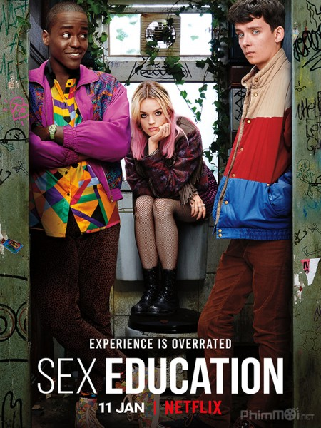

<!DOCTYPE html>
<html lang="vi"> 
    <head>
        <meta charset="utf-8"> 
        <title>Film n Book</title>
        
        <link href="https://stackpath.bootstrapcdn.com/bootstrap/4.5.0/css/bootstrap.min.css" rel="stylesheet" integrity="sha384-9aIt2nRpC12Uk9gS9baDl411NQApFmC26EwAOH8WgZl5MYYxFfc+NcPb1dKGj7Sk" crossorigin="anonymous">
        
        <link rel="stylesheet" type="text/css" href="style.css">
        <link href="https://fonts.googleapis.com/css2?family=Montserrat:ital,wght@0,300;1,300&display=swap" rel="stylesheet">
        
    </head>
    <body>
        <header>
           <!-- <h1 style="color:purple;">Lương Linh Hương</h1> -->
           <nav class="navbar nav-expand-lg navbar-light bg-light">
               

               

           </nav>
           <!-- <nav> 
               <ul class="primary-nav"> 
                   <li class="primary-link"> <a href="Home.html">Home</a></li>
                   <li class="primary-link"> <a href="Phim.html">Phim</a></li>
                   <li class="primary-link"> <a href="Sach.html">Sách</a></li>
               </ul>
               <ul class="ulti-class"> 
                   <li>
                       <label>
                    <input type="Text" placeholder="Tìm kiếm" style="height:40px ; width: 80%;">
                       </label>
                    </li> 
               </ul>
            </nav> -->
        </header>
    

        <main>
            <article class="Review"> 
                <section class="Review-movies"> 
                    <h2>REVIEW PHIM</h2>
                    

                        

                           
                        

                        

                           
                        

                        

                           
                        

                    

                    

                        <a href="reviewmovies.html">Tìm hiểu thêm</a>
                    

                </section>
                <section class="Review-books"> 
                    <h2>REVIEW SÁCH</h2>
                    

                        

                          
                        

                        

                          
                        

                        

                          
                        

                    

                    

                        <a href="reviewbooks.html.html">Tìm hiểu thêm</a>
                    

                </section>
            </article> 
            <article>
                <section class="Form"> 
                    <form style='padding-bottom: 20px;'>
                        <h2 style="color: crimson;">WHAT DO YOU THINK</h2>
                          <h3>Bình luận</h3>
                          <label>
                            <input type="text" style="width: 50%; height: 40px">
                          </label>
                          <h3>Tên</h3>
                        

                          <label>
                            <input type="Text" style="width: 50%; height: 40px;">
                          </label>
                          <button class="feedback">Phản hồi</button>
                        

                    </form>
                </section>
            </article>       
        </main>
    

    
        <footer>
               <h2 style="color: orangered">Lối nhỏ</h2>
            

               <h2 style="color: orangered;">Mới nhất</h2>
            

            

               <h2 style="color: orangered">Vài lời</h2>
            

​
            

                <ul>
                  <li><a href="trang chu.html">Home</a></li>
                  <li><a href="https://www.facebook.com/hlinh0102/">Liên hệ</a></li>
                </ul>
            

​
            

                
            

            

                
Welcome mọi người đến với chuyên mục review của Linh Hương =))

            

        </footer>
    </body>
</html>

html {
    font-family: 'Times New Roman', Times, serif;
    font-size: 22px;
}

header {
    text-align: right;
    background-color: rgba(106, 124, 170, 1);
    display: grid;
    grid-template-columns: 1fr 1fr;
}

.primary-link {
    display: inline; 
    text-transform: uppercase;
}

.primary-link {
    background-color: rgba(207, 148, 148, 1);
    padding: 10px;
    margin: 10px;
}

.ulti-class {
    list-style-type: none;
}

.background {
    position: relative;
    z-index: 1;
}
.background:after {
    content: " ";
    background: url(blending\ colors.jpg);
    position: absolute;
    z-index: -1;
    top: 0; 
    left: 0;
    width: 100%; 
    height: 100%;  
    opacity: 0.5; 
    background-repeat: no-repeat;
    background-size: cover;
}

.Review {
    text-align: center;
}

.Form {
    text-align: center;
}

.flexbox2 {
    display: flex;
    flex-direction: column;
}

footer {
    display: grid;
    grid-template-columns: 1fr 1fr 1fr ;
    background-color: lightgoldenrodyellow;
}

.latest-review {
    align-self: center;
}

.flexbox {
    display: flex;
    flex-direction: row;
    justify-content: space-around;
}

.feedback {
    margin-top: 50px;
    width: 10%;
    align-self: center;
    font-size: 100%;
}

.welcome {
    text-align: center;
}

.hello {
    padding-left: 60px;
}

.lastest-post {
    padding-left: 60px;
}

<head>
    <meta charset="utf-8">
    <meta name="viewport" content="width=device-width, initial-scale=1, shrink-to-fit=no">
    <link href="https://fonts.googleapis.com/css2?family=Charmonman:wght@700&family=Montserrat:ital@0;1&display=swap" rel="stylesheet">
    <!-- <link rel="stylesheet" href="https://stackpath.bootstrapcdn.com/bootstrap/4.5.0/css/bootstrap.min.css" integrity="sha384-9aIt2nRpC12Uk9gS9baDl411NQApFmC26EwAOH8WgZl5MYYxFfc+NcPb1dKGj7Sk"  -->
    <!-- crossorigin="anonymous"> -->
    <link rel="stylesheet" href="https://stackpath.bootstrapcdn.com/bootstrap/4.1.3/css/bootstrap.min.css" integrity="sha384-MCw98/SFnGE8fJT3GXwEOngsV7Zt27NXFoaoApmYm81iuXoPkFOJwJ8ERdknLPMO"
        crossorigin="anonymous">
    <link rel="stylesheet" href="./style.css">

    <title>Film n Book</title>
    <link rel="icon" href="https://thuthuattienich.com/wp-content/uploads/2017/06/anh-dai-dien-facebook-cho-meo-de-thuong-14.jpg" type="image/icon type">
</head>

<nav class="navbar navbar-dark navbar-expand-md py-0 fixed-top">
        <a class="navbar-brand" href="#">Film n Book</a>
        <button class="navbar-toggler" type="button" data-toggle="collapse" data-target="#navbarText" aria-controls="navbarText" aria-expanded="false" aria-label="Toggle navigation">
            
          </button>
        

            <ul class="navbar-nav">
                <li class="nav-item">
                    <a href="#" class="nav-link">HOME</a>
                </li>
                <li class="nav-item">
                    <a href="#" class="nav-link">PHIM</a>
                </li>
                <li class="nav-item">
                    <a href="#" class="nav-link">SÁCH</a>
                </li>
            </ul>
        

    </nav>

<!-- phim.html -->

<!DOCTYPE html>
<html lang="en">
<head>
    <meta charset="UTF-8">
    <meta name="viewport" content="width=device-width, initial-scale=1.0">
    <title> Review phim </title>
</head>
<body>
    <h1>Review List</h1>
    

        

            <h2>The end of the f**king world</h2>
            

            
Netflix

            

                Đạo diễn: Jonathan Entwistle; Lucy Tcherniak; Lucy Forbes; Destiny Ekaragha  
                Diễn viên: Jessica Barden, Alex Lawther
            

            <a href="end1.html" target="blank">
                <button>Đọc ngay</button>
            </a>
        

    

    

        

            <h2>The end of the f**king world 2</h2>
            

            
Netflix

            

                Đạo diễn: Jonathan Entwistle; Lucy Tcherniak; Lucy Forbes; Destiny Ekaragha  
                Diễn viên: Jessica Barden, Alex Lawther
            

            <a href="end2.html" target="blank">
                <button>Đọc ngay</button>
            </a>
        

    

    

        

            <h2>Sex education</h2>
            

            
Netflix

            

                Đạo diễn: Ben Taylor; Kate Herron; Sophie Goodhart; Alice Seabright  
                Diễn viên: Asa Butterfield; Emma Mackey; Gillian Anderson; 	Ncuti Gatwa
            

            <a href="sexed.html" target="blank">
                <button>Đọc ngay</button>
            </a>
        

    

</body>
</html>

<!-- Sách -->

<!DOCTYPE html>
<html lang="en">
<head>
    <meta charset="UTF-8">
    <meta name="viewport" content="width=device-width, initial-scale=1.0">
    <title> Review truyện </title>
</head>
<body>
    <h1>Review List</h1>
    

        

            <h2>Nơi em quay về có tôi đứng đợi</h2>
            

            
Nhà xuất bản văn học

            

                Thể Loại : Tiểu Thuyết Phương Tây  
                Tác giả : Ichikawa Takuji
            

            <a href="noiem.html" target="blank">
                <button>Đọc ngay</button>
            </a>
        

    

    

        

            <h2>Em sẽ đến cùng cơn mưa</h2>
            

            
Nhà xuất bản văn học

            

                Thể Loại : Tiểu Thuyết Phương Tây  
                Tác giả : Ichikawa Takuji
            

            <a href="emse.html" target="blank">
                <button>Đọc ngay</button>
            </a>
        

    

    

        

            <h2>Tôi vẫn nghe tiếng em thầm gọi</h2>
            

            
Nhà xuất bản văn học

            

                Thể Loại : Tiểu Thuyết Phương Tây  
                Tác giả : Ichikawa Takuji
            

            <a href="toivan.html" target="blank">
                <button>Đọc ngay</button>
            </a>
        

    

</body>
</html>

<!-- em sẽ đến -->
<!DOCTYPE html>
<html lang="en">
<head>
    <meta charset="UTF-8">
    <meta name="viewport" content="width=device-width, initial-scale=1.0">
    <title>Review - Em sẽ đến cùng cơn mưa</title>
</head>
<body>
    <!-- nguồn: reviewsach.net -->
    
    <h1>Em sẽ đến cùng cơn mưa – Hành trình khám phá, một lần nữa, về tình yêu đã mất</h1>
    
    
<b>
        “Em sẽ đến cùng cơn mưa” câu chuyện của người đàn ông đánh mất hạnh phúc vào tay thần chết. 
        Nhưng rồi rốt cục anh cũng tìm lại chính mình nhờ phép màu tưởng chừng chỉ có trong cổ tích: 
        Đó là gặp và yêu lại Mio-người vợ đầu ắp tay gối đã qua đời một năm- trong cơn mưa tháng 6.
    </b>

    <h3>Không phải cuốn sách của những giai điệu ngôn tình</h3>
    

        “Em sẽ đến cùng cơn mưa” kèm bìa sách lãng mạn khiến độc giả dễ dàng liên tưởng tới những câu 
        chuyện ngôn tình, với hình mẫu nam chính đẹp trai, giàu có, lịch thiệp.
    

    

        Nhưng thực ra, Takkun trong câu chuyện cổ tích này lại là hình mẫu mà các chị em đều muốn tránh.  

        Anh nhạy cảm hơn người bình thường. Anh không có khiếu ăn nói hài hước, mới 29 tuổi đã bệnh tật đầy người.  

        Với nhược điểm không thể tập trung và rất hay quên, anh phải bỏ dỡ việc học và không thể thăng tiến trong sự nghiệp.  

        Trong mắt người khác, anh là tên thất bại yếu đuối. Anh như loài động vật ăn cỏ sắp tuyệt chủng trong xã hội những con thú ăn thịt hung dữ.  

        Vì một chút sai sót trong sơ đầu cấu tạo mà cuộc đời anh rẽ lối. Giàu có, danh vọng, tiền bạc anh chẳng có gì. 
    

    
    <h3>Còn vợ anh thì xinh đẹp, quyến rũ, tài năng</h3>
    

        Thế gian được vợ thì hỏng chồng. Các cụ đã dạy như thế. Trái ngược với chàng trai không có lấy 
        một ưu điểm nào, vợ anh lại có cả tá thành tích nổi bật. Nàng xinh đẹp, giỏi giang lại nghiêm 
        túc đầy mẫu mực. Nàng là đối tượng theo đuổi của không biết bao chàng trai.
    

    

        Vậy mà nàng chọn anh chàng Takkun thất bại, nhiều khuyết điểm này. Thay vì sống ở thủ đô Tokyo nhộn nhịp, 
        nàng chọn sống cùng chồng ở thị trấn nhỏ xa xôi.  

        Thay vì có cuộc sống giàu sang, nàng chọn ở cùng người đàn ông đó trong căn hộ tập thể bình thường.  
        
        Thay vì thoải mái du lịch, đi mua sắm, spa, Nàng chọn làm mẹ đứa con trai của một người đàn ông thất bại, 
        hằng ngày chăm sóc gia đình, chăm sóc cậu con trai đang tuổi ăn tuổi lớn.  
        
        Một câu chuyện cổ tích đã bắt đầu như thế. 
    

    <h3>Họ đến với nhau vì tình yêu đã tìm thấy họ</h3>
    

        Takkun-Mio đã có gia đình hạnh phúc, người vợ xinh đẹp, tài năng không vì “mớ” khuyết điểm mà 
        quay lưng với anh, bù lại là nguồn động viên tinh thần vô cùng lớn. Cậu con trai kháu khỉnh, 
        mang nửa dòng máu đặc biệt của cha và nửa dòng máu tuyệt vời của mẹ là món quà vô giá họ có.
    

    
    

        Đó là động lực sống duy nhất của anh.  
        Anh như chim cánh cụt mọc cánh bay lên trời xanh, ở trên cao nhìn thấy mọi điều xấu xí phía dưới. 
        Khi đôi cánh biến mất con chim cánh cụt rớt xuống mặt đất.
    

    

        Tử thần xuất hiện cướp đi người vợ yêu dấu. Anh chao đảo không còn chỗ nương tựa.  

        Người đầu ắp tay gối, là mối tình đầu, là người anh yêu và cứ ngỡ sẽ cùng nắm tay đến cuối cuộc đời. 
        Nhưng người đó ra đi quá sớm, mang theo tất cả tình yêu thương về tinh cầu Lưu Trữ.  
    
        Người còn lại phải sống vì đứa con, dẫu mang trái tim thương tổn, dẫu đời không còn là màu hồng. 
        Yuji là lý do duy nhất anh chưa thể gặp Mio.  

        Đó là câu chuyện của Takkun, trước khi biến cố xuất hiện.
    

    <h3>“Nếu yêu thương kia trở lại anh sẽ vẫn yêu những gì còn lại….”</h3>
    

        Câu chuyện không những mang tính nhân văn mà còn là liều thuốc hoá giải cho con tim chịu nhiều thương tổn.
    

    

        Takkun đã đau khổ thế nào khi Mio qua đời. Anh tự trách mình chưa làm tròn trách nhiệm của người chồng, người cha. Takkun và Mio chưa bao giờ có tuần trăng mật đúng nghĩa. 
        Anh cũng chưa hoàn thành lời hứa năm nào với Mio sẽ chăm sóc Yuji thật tốt.
    

    

        Đau khổ của anh, càng ngày càng lớn. Dẫu có Yuji bên cạnh, nhưng Yuji là Yuji, không thể thay thế hình bóng người phụ nữ kia được.  

        Vả lại trong thâm tâm cậu nhóc cũng mang mặc cảm chỉ vì sinh mình là mẹ qua đời.  

        Ngôi nhà hạnh phúc giờ chỉ là niềm thương nhớ vô hạn. Có khi cả hai cố tỏ ra bình thường vì tin lời hứa của Mio trước khi qua đời.
    

    <h3>“Em sẽ trở lại vào mùa mưa năm sau để xem hai cha con sống như thế nào. Khi mùa mưa kết thúc em lại đi vì không chịu được nắng”</h3>
    
    

        Tưởng đùa hoá ra thật, một ngày mưa tháng 6 họ gặp một cô gái có ngoại hình giống hệt Mio. Khuôn mặt, giọng nói, tính cách đều của Mio. 
        Ngoại trừ nàng… không nhớ chút gì về cuộc sống trước đây.
    

    

        Takkun và Yuji sẽ đối mặt với điều này ra sao ?  

        Chỉ có thể là Takkun và Yuji mà thôi, một năm chưa đủ xóa nhòa vết thương lòng. Mio là tất cả, Mio ra đi đem theo cả một trời thương nhớ.  

        Khi nàng xuất hiện, yêu thương đã chết sống lại. 

        Kể cả khi nàng không nhớ gì ! Kể cả khi Takkun cho rằng đó là linh hồn Mio trở về từ hành tinh Lưu Trữ.  

        Cô gái kia nhẹ nhàng chiếm lấy sự quan tâm của bố con Takkun-Yuji, cô nhanh chóng thích nghi vai trò làm vợ, làm mẹ.
    

    

        Tổn thương năm nào của Takkun và Yuji dần nguôi ngoai. Họ cùng nhau tập sự cách yêu thương, và được yêu thương. Thêm một lần nữa.  

        Yêu hồn ma vợ mình thì sao. Mỗi sáng anh lại được nàng chuẩn bị bữa sáng, được nghe tiếng chào tạm biệt của nàng trước khi đi làm, 
        được hôn nàng, được hít hà mùi thơm của nàng. Với Takkun, còn gì hạnh phúc hơn thế. Những hạnh phúc thật bình dị mà lớn lao.
    

    

        Có mẹ trở về từ hành tinh Lưu Trữ thì sao. Yuji lại được mẹ ráy tai, được nắm tay me, được ôm chầm lấy mẹ mỗi sáng. 
        Thằng bé nhạy cảm và thiếu sự chăm sóc của mẹ hơn 1 năm nay rồi! Một đứa trẻ, một niềm vui thật nhỏ nhoi, đơn giản được gần mẹ thêm chút nữa. Chỉ vậy thôi.
    

    

        Căn nhà lại ngập tràn tình yêu thương. Bàn tay phụ nữ khiến cuộc sống cha con Takkun – Yuji tốt hơn, vết thương lòng của họ dần phai nhạt.
    

    <a href="story.html"><h2>Các bài viết khác</h2></a>
</body>
</html>

<!-- nowi em quay ve -->

<!DOCTYPE html>
<html lang="en">
<head>
    <meta charset="UTF-8">
    <meta name="viewport" content="width=device-width, initial-scale=1.0">
    <title>Review - Nơi em quay về có tôi đứng đợi</title>
</head>
<body>
    <!-- nguồn: kilala.vn -->
    
    <h1>"Nơi em quay về có tôi đứng đợi" - Một ý niệm khác về tình yêu</h1>
    
    
<i>
        Chia ly không phải là đề tài mới mẻ trong văn học nhưng ở mỗi thời kì, mỗi cá tính văn chương sẽ có những cách khai thác 
        khác nhau. Ở “Nơi em quay về có tôi đứng đợi”, Ichikawa Takuji lại chọn một lối đi không giống ai khi viết nên câu chuyện 
        về cuộc chia ly vốn nhuốm màu buồn thương nhưng rất đỗi dịu dàng, sáng trong và lấp lánh ánh nắng.
    </i>

    <h3>Cuộc đời là chuỗi hội ngộ và chia ly</h3>
    

        Mở đầu tác phẩm , Ichikawa Takuji mở ra trước mắt người đọc hình ảnh gợi hình đầy cảm xúc: “Kí ức ban sơ nhất , chính là 
        màu trắng đẹp đẽ của chiếc áo lót nhìn qua lần áo sơ mi của em”. Nhân vật chính là Satoshi và Yuko, cả hai quen biết nhau 
        từ năm mười lăm tuổi, khi còn là bạn đồng môn thời Trung học. Năm 18 tuổi, cũng vào một ngày thu khi “những cành cây đã 
        nhuốm sắc thu khe khẽ đung đưa theo gió, phát ra những tiếng rì rào, giống như bọn trẻ con huýt sáo”, họ lại gặp nhau lần 
        nữa. Những rung động đầu đời ấy như thể hạt mầm đã ủ mình thật lâu trong đất, chỉ chờ ngày vươn đón ánh nắng mai. Họ đã 
        dành hết những niềm yêu cho mối tình đầu của mình, như thể bù đắp lại khoảng thời gian ba năm dài mà cả hai đã lỡ bỏ, 
        chỉ bởi “thường ngày chúng mình toàn để lỡ cái một chút ấy”.
    

    
    

        Gần tốt nghiệp Đại học, Yuko có thai, cả hai quyết định cưới nhưng lại phải chịu sự phản đối gay gắt từ cả hai bên gia 
        đình.“Câu nói kinh khủng này khiến sắc mặt chúng tôi tái mét, chuẩn bị phản kháng đến cùng những ông bố, bà mẹ lạnh 
        lùng kia. Trong tay họ toàn là vũ khí hạng nặng như xã hội, thường thức và đạo đức”. Cuối cùng, cả hai chọn từ bỏ gia 
        đình để dọn về sống cùng nhau, vun vén một tổ ấm mới. Ý nghĩa của tình yêu, phải chăng là thế: không cần sự đồng ý từ 
        ai khác, chỉ cần hai người hiểu và sẵn sàng nắm tay nhau đi qua mọi bình yên hay giông bão, là đã trọn vẹn lắm rồi.
    

    

        Nhưng trớ trêu thay, Yuko bỗng nhiên mắc phải một chứng bệnh kì lạ: cơ thể cô cứ dần “trẻ hóa” một cách khó hiểu, 
        thậm chí trở về trong bộ dạng của một đứa trẻ lên năm. Dẫu đứa bé không được sinh ra, Yuko phải đối mặt với cơ thể 
        ngày một bé đi, nhưng ít nhất trong trái tim của Yuko, của Satoshi, luôn có một khoảng trống thật đẹp dành trọn cho 
        đứa bé ấy. Điều còn lại sau tất thảy chính là tình yêu và những kí ức, dẫu chúng có ít ỏi đến mức nào. Vì “Cuộc đời 
        vốn là những chuỗi hội ngộ và chia ly. Hội ngộ là để chia ly. Chia ly là để có ngày hội ngộ. Chỉ cần có tình yêu 
        thì sự chia ly cũng không còn đáng sợ”.
    

    <h3>Một ý niệm khác về tình yêu</h3>
    

        Chợt nhận ra, tình yêu đẹp nhất không nằm ở năm tháng rộng dài bên nhau, mà nằm ở thẳm sâu bên trong trái tim của 
        người đang yêu. “Thế giới lớn hay nhỏ, có nhiều hay ít người liên hệ với mình, thời gian ở bên nhau dài hay ngắn, 
        những thứ ấy đều chẳng có ý nghĩa nhiều lắm. Bởi lẽ, hạnh phúc, chỉ tồn tại trong trái tim nhỏ bé nhường này”. 
        Sẽ thật sai lầm nếu ai đó nói rằng “Nơi em quay về có tôi đứng đợi” đẫm màu sắc ngôn tình. Bởi mọi cảm xúc đều 
        được Ichikawa Takuji lột tả thực đến mức tưởng như đó là câu chuyện của chính ông vậy. Người đọc không có cảm 
        giác như đang lạc vào một thế giới xa lạ, mọi thứ đều gần gũi và thân quen như cuộc sống bình dị thường ngày. 
        Yêu nào phải câu chuyện lớn lao, phức tạp, nó đơn giản chỉ là những rung động của trái tim mà thôi.
    

    
    

        Thật hạnh phúc nếu được hội ngộ người mình hằng yêu thương và mong đợi. Nhưng cũng không hẳn là bất hạnh nếu hội 
        ngộ phút chốc đã chia ly. Bằng niềm tin và tình yêu, người ta sẽ nương tựa vào đó để học cách sống, học cách 
        tiếp tục vươn lên.  Không phải gượng ép mà là dần quen.
    

    

        Quả thật con người là thế, thường dành phần lớn cuộc đời của mình vào việc chờ đợi: chờ đợi một mối duyên tình, 
        chờ đợi người mình yêu, chờ đợi người yêu thương mình thật lòng. Chờ đợi không đáng sợ, đáng sợ là khi bạn không 
        biết phải chờ đến bao giờ. Nhưng nếu biết trước có thể đợi được bao lâu, thì còn ai đợi ai làm gì?
    

    
    <a href="story.html"><h2>Các bài viết khác</h2></a>
</body>
</html>

<!-- toi van nghe tieng em tham goi -->
<!DOCTYPE html>
<html lang="en">
<head>
    <meta charset="UTF-8">
    <meta name="viewport" content="width=device-width, initial-scale=1.0">
    <title>Review - ôi vẫn nghe tiếng em thầm gọi</title>
</head>
<body>
    
    <h1>Tôi Vẫn Nghe Tiếng Em Thầm Gọi - chất chứa nhiều nhẹ nhàng, bùi ngùi, luyến tiếc.</h1>
    
<i><b>
        Đây là tác phẩm đầu tay của Ichikawa Takuji. Ông luôn viết những cuốn sách có ấn tượng đầu tiên là bìa rất đẹp, 
        rồi sau đấy là những cái tựa buồn man mác, chút hi vọng cũng đan xen chút tuyệt vọng. Cuối cùng là một giọng 
        văn nhẹ nhàng như nước chảy, nhưng có lúc lại dội vào những điểm yếu thầm kín của chúng ta đầy bâng khuâng.
    </b></i>

    
    

        Cuốn sách là câu chuyện về Satoru và Yuko, đều là những thiếu niên bị ám ảnh bởi cái chết của người thân. 
        Nếu Satoru cứ dằn vặt mình trước cái chết đau xót của người em trai mình đã không tới kịp lúc. Thì Yuko luôn 
        trói buộc mình bởi cái chết lạnh lẽo rình rập đằng sau, giống như sự ra đi của người mẹ trong cơn bạo bệnh. 
        Và thế là họ đã gặp nhau. Satoru có thể nghe được tiếng lòng của Yuko, và nhận ra cô gái này rất thích anh. 
        Những câu chuyện, những ký ức, những mẩu hội thoại khiến họ nhận ra mình hoàn toàn “dung hợp” với đối phương. 
        Từ đó có một thứ tình cảm, gọi là mối tình đầu. Như bất kỳ ai đã biết, tình đầu luôn chứa đựng nhiều thứ cảm 
        xúc trái ngang nhất trong lòng, và cũng là mối tình ghi ấn đậm sâu nhất.
    

    
    

        Thế nhưng mối tình đầu của họ lại quá buồn tủi. Satoru cứ mãi trong vỏ kén của mình, trốn mình trong một 
        thành phố buồn tẻ với sự ích kỉ. Còn Yuko đã rời xa anh để lên Tokyo học đại học. Không giống như “Em sẽ 
        đến cùng cơn mưa”, có lẽ chính nghịch lý này khiến <b>“Tôi Vẫn Nghe Tiếng Em Thầm Gọi” </b>là câu chuyện bao phủ 
        một màu xám buồn từ đầu đến cuối. Luôn có những khó khăn và trắc trở trong cuộc sống những người trẻ, Ichikawa 
        Takuji đã viết lên câu chuyện không chỉ bằng cảm xúc mà còn rất nhiều triết lý trong cuộc đời.
    

    
    

        Chủ đề của câu chuyện luôn gắn liền với cái chết, nhưng như thế nó lại nói rất đúng về những người trẻ muốn 
        bỏ cuộc. Tác phẩm đầu tay của Ichikawa Takuji đã thành công với những cảm giác và triết luận sâu đậm. Và không 
        chỉ thành công ở nội dung mang nhiều nỗi nhớ khắc khoải, Ichikawa Takuji còn miêu tả nội tâm hai nhân vật Satoru 
        và Yuko rất có chiều sâu. Một chút giả tưởng trong cuốn sách đã đẩy mạch truyện cao trào và thu hút hơn, cùng 
        với giọng văn nhẹ nhàng, man mác buồn giống như một con gió thoang thoảng tâm hồn.
    

    
    

        Cũng là về đề tài tình yêu, cuộc sống, gia đình, nhưng sao tôi thấy “Tôi vẫn nghe tiếng em thầm gọi” lại đặc biệt hơn nhiều. 
        Có lẽ, Ichikawa Takuji đã khắc hoạ lên hai con người quá đồng điệu về tâm hồn, có lẽ ông đã đánh thức những giấc mơ về mối 
        tình đầu quá bồi hồi, và có lẽ ông đã để cho nó kết thúc quá nuối tiếc. Nhiều chữ “quá” thành một chữ “nhớ”, khiến cho người 
        đọc cảm thấy đậm sâu và khắc ghi trong lòng những cung bậc cảm xúc khó quên về tác phẩm. Như tác giả đã viết rằng:  

        <i><b>“Là một tiểu thuyết buồn tuyệt đối. Không có dự cảm về hạnh phúc cũng chẳng có sự cứu rỗi nào.”</b></i>
    

    <a href="story.html"><h2>Các bài viết khác</h2></a>
</body>
</html>

<!-- sex education -->

<!DOCTYPE html>
<html lang="en">
<head>
    <meta charset="UTF-8">
    <meta name="viewport" content="width=device-width, initial-scale=1.0">
    <title>Review - Sex education </title>
</head>
<body>
    <!-- nguồn: moveek -->
    
    <h1>Sex Education – Cuốn từ điển sống về giáo dục giới tính của nhà đài Netflix</h1>
    

        <b>Sex Education</b> là loạt phim truyền hình hài kịch của Anh, được sáng tạo bởi Laurie Nunn và ra mắt vào ngày 11 tháng 1 năm 2019 trên Netflix. 
        Series có sự tham gia của các diễn viên Gillian Anderson, Asa Butterfield, Ncuti Gatwa, Kedar Williams‑Stirling, Connor Swindells. Điểm sáng 
        của <b>Sex Education</b> chắc chắn phải kể đến Asa Butterfield, diễn viên trẻ tài năng sinh năm 1997.
    

    

        Như tên gọi, <b>Sex Education</b> (tạm dịch: Giáo dục giới tính)tập trung vào đời sống học đường và xu hướng tình dục của những cô cậu đang tuổi 
        thiếu niên. Nói một cách thẳng thắn và trực diện, <b>Sex Education</b> sẽ đề cập rất nhiều về Sex, vậy nên hãy đảm bảo bạn trên 16 tuổi để thưởng 
        thức bộ phim này nhé!
    

    
    

        Chuyện phim xoay quanh Otis (Asa Butterfield) là chàng trai nai tơ có mẹ là nhà tư vấn tình dục. Trong khi mọi người đồng trang lứa với Otis 
        ở trường đều đã có trải nghiệm riêng thì cậu chàng vẫn “thủ thân như ngọc” và không mấy hứng thú với chuyện đó. Nhưng mọi chuyện thay đổi 
        khi cô bạn gái Maeve (Emma Mackey) xuất hiện, Otis cùng Maeve thành lập nhóm tư vấn “tình yêu” cho các học sinh trong trường để kiếm thu nhập, 
        và đương nhiên Otis đảm nhận trọng trách chính vì bản thân cậu có năng khiếu trong chuyện này.
    

    

        Thoạt nghe thật kì lạ khi chuyện tư vấn riêng tư như vậy lại dành cho một anh chàng không có kinh nghiệm và thiếu trầm trọng kĩ năng “mềm”. 
        Nhưng lí do về nỗi ám ảnh của Otis sẽ được tiết lộ về sau một cách không thể hợp lí và logic hơn
    

    
    

        <b>Sex Education</b> lấy chủ đề vừa mới lạ vừa quen thuộc với tất cả chúng ta. Khi những câu chuyện xoay quanh tình dục tuổi mới lớn, giáo dục giới 
        tính và các mối quan hệ học đường dường như bị bỏ quên bởi cha mẹ còn e ngại, tránh né và cho đây là chuyện nhạy cảm (xảy ra ở nhiều nước Á 
        Đông, trong đó có Việt Nam). Phải chăng Netflix muốn mọi người nhìn nhận lại vấn đề này một cách thẳng thắn bằng cách diễn đạt nó thông qua 
        sự hài hước và nhẹ nhàng đúng chất hài kịch.
    

    

        <b>Sex Education</b> xoay quanh Otis - nam sinh 16 tuổi có bóng đen tâm lí về chuyện quan hệ, nhưng không vì thế mà bỏ qua nhiều vấn đề nổi cộm khác 
        của lứa tuổi vị thành niên. Loạt phim không nhiều nhân vật và mỗi người đều có những mẩu chuyện nhỏ khác nhau nhưng khi tổng hòa lại trong 
        <b>Sex Education</b>, nó mượt mà và phản ánh đúng những gì đang xảy ra trong giới trẻ phương Tây và thậm chí nhiều nước khác ở phương Đông.
    

    
    

        Eric (Ncuti Gatwa) bạn thân Otis – đồng tính nam, đã công khai xu hướng tính dục và đang chịu nhiều sự dè bỉu từ bạn bè đồng trang lứa. Adam 
        – nam sinh điển trai “khỏe mạnh” là con trai hiệu trưởng nhưng rắc rối bủa vây chẳng kém ai. Lily – cô bạn lập dị thích bạch tuộc và bị ám 
        ảnh bởi cảm giác làm tình, nhưng đâu ai biết đằng sau điều đó Lily là một tâm hồn dễ tổn thương và rất cô đơn. Maeve (Emma Mackey), ngầu, 
        đáng sợ và mạnh mẽ là những từ có thể miêu tả cô nàng nếu gặp lần đầu, nhưng đã ai hay những điều khó khăn Maeve đang đối mặt…
    

    

        Và còn nhiều, rất nhiều những câu chuyện nhỏ khác được cài cắm vô cùng hợp lí và mượt mà trong <b>Sex Education</b>. Qua đó, phải chăng series muốn 
        truyền tải nhiều thông điệp cho giới trẻ hơn là chỉ tập trung vào Sex như nhiều người lầm tưởng. Cái hay của phim là lồng ghép được nhiều 
        vấn đề nhạy cảm cảm khó nói vào mạch phim đầy ắp tiếng cười và sự ngượng ngùng của tuổi dậy thì.
    

    
    

        <b>Sex Education</b> – Giáo dục giới tính, đúng như những gì cái tên phim thể hiện, tác phẩm xuất hiện kha khá cảnh nhạy cảm trần trụi và những hình 
        ảnh minh họa tương đương. Những vấn đề như quan hệ tình dục đồng tính, dị tính, thủ dâm hay mộng tinh ở con trai (còn gọi là giấc mơ ướt) được 
        nhắc đến xuyên suốt mạch phim, nhưng không hề quá lố và khiến người xem bội thực, những phân cảnh nhạy cảm được khéo léo lồng ghép rất hợp lí 
        và hài hước.
    

    

        Thế nhưng liệu <b>Sex Education</b> có phải loạt phim chỉ tập trung nói về vấn đề tình dục tuổi vị thành niên hay không. Chắc chắn là không, bởi yếu 
        tố Giáo Dục được nhà làm phim xếp trên một bậc. Sự hài hước và các phân cảnh nhạy cảm là sợi dây dẫn dắt khán giả từ đủ mọi lứa tuổi cùng xem 
        và trải nghiệm câu chuyện của những người trẻ 16-17 tuổi, cùng lắng nghe lời tâm sự thầm kín của họ và thấu hiểu cho nhiều số phận không hoàn 
        hảo như bạn nghĩ.
    

    
    

        Vấn đề nạo phá thai không còn xa lạ gì với cuộc sống ở thế kỉ 21, nhưng thay vì ủng hộ việc sinh nở một cách thiếu kiến thức và lương tâm thì 
        ta nên tập trung vào việc Giáo Dục Giới Tính cho người trẻ để tránh trường hợp đáng tiếc xảy ra. Như cách Netflix đã làm thông qua câu chuyện 
        của Maeve. Dính thai khi tuổi mới 16, không có phụ cấp từ bố mẹ và người thân, đang phải nát óc nghĩ cách kiếm tiền trả nợ, thì thật ngạc nhiên 
        nếu Maeve giữ đứa bé lại.
    

    

        Mấy ai tường tận chuyện sử dụng các biện pháp tránh thai để rồi lâm vào cảnh như Maeve. Dùng bao cao su vẫn có thể dính bầu, thuốc tránh thai 
        có thể mất tác dụng nếu không uống đúng lúc, bạn đã biết chưa? Chuyện quan hệ đồng tính sẽ gặp phải những vấn đề nhất định mà lại khó nói được 
        với ai như Adam – Eric và cặp đôi Ruthie. Chuyện gặp “giấc mơ ướt” như Otis không hề xa lạ với bất kì nam sinh nào.
    

    
    

        Series đã được phát sóng đủ 8 tập với phụ đề Việt ngữ trên đài Netflix. <b>Sex Education</b> là tác phẩm hài hước và vui nhộn bậc nhất trong số những 
        series ra mắt tháng này. Vậy nên đừng ngại gia hạn tài khoản của bạn để thưởng thức cuốn cẩm nang sống về tình cảm học trò này nhé.
    

    <a href="film.html"><h2>Các bài viết khác</h2></a>
</body>
</html>

the end 1
<!DOCTYPE html>
<html lang="en">
<head>
    <meta charset="UTF-8">
    <meta name="viewport" content="width=device-width, initial-scale=1.0">
    <title>Review - The end of the f**king world</title>
</head>
<body>
    <!-- nguồn facebook -->
    
    <h1>The End of The F***ing World - Ai mới là kẻ điên?</h1>
    

        <b>The End Of The F***ing World</b> là một bộ phim được sản xuất bởi đài truyền hình Channel 4 của Anh, và được <b>Netflix</b> mua lại bản quyền. 
        <b>The End Of The F***ing World</b> là một phim hài kịch Black Comedy do <b>Alex Lauthor</b> và <b>Jessica Barden</b> thủ vai 2 nhân vật chính của chúng ta là <b>James</b> và <b>Alyssa</b>.  
        Trong phim, <b>James</b> một cậu bé luôn tin rằng bản thân bị tâm thần, cậu vô cảm trước mọi việc xảy ra, dành cả tuổi thơ để giết động vật và làm đau bản thân, 
        James muốn mình có thể "cảm thấy một chút cảm xúc gì đó", nhưng như thế là không đủ. 
        Đến năm 17 tuổi, <b>James</b> quyết định sẽ giết một người và mục tiêu của cậu là <b>Alyssa</b> - một cô gái xem cuộc sống chung quanh vô cùng buồn chán và không bao giờ 
        ngại bộc lộ cảm xúc, dù đó có là chửi thề vào mặt một người đáng tuổi mẹ mình. 
        Tình cờ <b>Alyssa</b> lại để ý và thích phong cách bất cần của <b>James</b>, cô rủ anh bỏ nhà đi bụi và với <b>James</b>, đây là cơ hội không thể tuyệt vời hơn để giết người.
    
 
    
    

        <b>The End Of The F***ing World</b> không ngại bàn về những chủ đề bạo lực thậm chí giết người theo một cách trẻ trâu nhưng lại vô cùng đáng yêu ! 
    
  
    
    

        Các nhân vật của <b>The End Of The F***ing World</b> được thể hiện một cách vô cùng xuất sắc, phim đã cho ta thấy một cặp <b>James</b> và <b>Alyssa</b> tuy rất dở người 
        nhưng phần nào đó lại thật đáng thương, kèm theo đó không thể không nhắc tới phần diễn xuất tuyệt đỉnh của gần như toàn bộ dàn diễn viên mà nổi bật nhất 
        là <b>Alex Lauthor</b> (vai James) và <b>Jessica Barden</b> (vai Alyssa). 
    

    
    

        Tuy là một phim hài kịch nhưng <b>The End Of The F***ing World</b> vẫn được chăm chút khá kĩ lưỡng về mặt hình ảnh và đặc biệt là phần nhạc phim được xử lí rất 
        xuất sắc luôn làm cho người xem vô cùng phấn khích mỗi khi bản nhạc nào đó vang lên. 
    
  
    
    

        Tóm lại thì <b>The End Of The F***ing World</b> là một trải nghiệm vô cùng điên rồ, hài hước nhưng cũng rất ý nghĩa, các bạn sẽ vừa được vui với những câu chuyện dở 
        khóc dở cười của cặp đôi teen, vừa được nhìn thấy những góc khuất của xã hội. Đây quả thật là một show cực hay, và không nên bỏ qua.  
    

    
    

        <i> <b>Số điểm của page sẽ là 9,7/10</b></i>
    

    <a href="film.html"><h2>Các bài viết khác</h2></a>
</body>
</html>

the end 2
<DOCTYPE html>
<html lang="en">
<head>
    <meta charset="UTF-8">
    <meta name="viewport" content="width=device-width, initial-scale=1.0">
    <title>Review - The end of the f**king world 2 </title>
</head>
<body>
    <!-- Nguồn: moveek -->
    
    <h1>The End of the F**king World 2 – Sự khác biệt... "kỳ quặc"</h1>
    

        <b>The End of the Fucking World</b> mùa 2 thay đổi nhiều so với phần 1.
    

    
   
        <b>The End of the Fucking World</b> mùa 2 khác biệt nhiều hơn và ở một khía cạnh nào đó là có phần kém thỏa mãn so với mùa 1. Tuy vậy, phim mang đến nhiều 
        cảm xúc và những khoảng lặng cần thiết để người xem có dịp ngẫm nghĩ thêm về chính bản thân mình.
    
  
       
    

        Mùa 2 của <b>The End of the Fucking World</b> tiếp nối sự kiện của phần 1 sau khi cảnh sát phát hiện ra nơi ở của <b><i>James</i></b> và <b><i>Alyssa</i></b>. Tưởng chừng 
        như quá khứ đã ngủ yên và mọi chuyện dần trở về guồng quay cũ, thế nhưng bóng đen hậu quả của vụ giết người trong mùa đầu tiên quay lại ám ảnh <b><i>Alyssa</i></b> khi 
        câu chuyện xuất hiện một nhân vật mới: <b><i>Bonnie</i></b>.
    
 
    

        Vốn là bộ phim nổi tiếng vì hơi dị, lạ thường và hơi tưng tửng, <b>The End of the Fucking World</b> mùa đầu tiên mang đến cho khán giả những khoảnh khắc thú vị, 
        nổi loạn và đặc biệt hài hước. Kỳ vọng của người xem dành cho mùa 2 đương nhiên rất cao, nhưng có lẽ vì kỳ vọng quá cao đó mà sự thay đổi phong cách của 
        <b>The End of the Fucking World</b> mùa 2 có thể khiến nhiều người không cảm thấy hài lòng. Nét hài hước, nhộn và nổi loạn của mùa đầu tiên đã không còn, nhường 
        chỗ cho cảm giác u tối, nặng nề và sự khó chịu trong tông phim khi từng nhân vật phải đối mặt với con quái vật mang tên sang chấn tâm lý. 
        Phim đương nhiên vẫn có những khoảnh khắc hài hước rất <b>The-End-of-the-Fucking-World</b>, nhưng so với mùa 1 thì các giây phút này không nhiều.
    

    
    

        Mặc dù là phim hài đen (dark comedy), teen drama… nhưng <b>The End of the Fucking World</b> nổi bật bởi sự sâu sắc trong từng tình huống, câu thoại và cách hành 
        xử của các nhân vật đối với xã hội xung quanh. 
        Những việc vốn bình thường như cắm mặt vào điện thoại khi ngồi ăn với nhau, trong mắt các nhân vật lại là hành động điên không tưởng. Còn những hành vi kỳ dị 
        như vừa lau chùi vết máu sau khi giết người, vừa nghe nhạc như đang làm việc nhà của <b><i>James</i></b> và <b><i>Alyssa</i></b> lại trở nên quá thường tình.
    

    

        Chính sự trớ trêu trong tình huống đó tạo nên nét đặc biệt của <b>The End of the Fucking World</b>. Series không đơn thuần kể một câu chuyện lạ lùng về một cặp đôi 
        16 tuổi nổi loạn, mà còn ném khán giả vào một góc nhìn khác về cuộc sống xung quanh ta, khiến ta tự hỏi liệu <b><i>James</i></b> và <b><i>Alyssa</i></b> là những kẻ điên, hay chính xã hội 
        và thế giới này mới đúng là không bình thường?
    
 
    
    

        <b>The End of the Fucking World</b> mùa 2 tập trung vào tâm lý và tình cảm nhân vật, không nhiều những tình tiết gây sốc cũng như những khoảnh khắc cao trào hài hước 
        trộn lẫn với sự khác thường. Thay vào đó, phim phần nào thay đổi thể loại, trở thành một bộ phim tâm lý về cách các nhân vật đối mặt với quá khứ hay tình cảm 
        của chính mình. Phim có khá nhiều khoảng lặng ngượng ngùng, vốn là không khí mang dụ ý của các nhà làm phim khi các nhân vật không biết phải nói gì với nhau, 
        suy nghĩ và hành động, lời nói của họ trái ngược nhau hoàn toàn khiến phim luôn mang cảm giác nặng nề, không thoải mái. 
        Sau các sự kiện mang tính thay đổi đời người của mùa đầu tiên, các nhân vật, dù muốn dù không cũng đều đã thay đổi và suy nghĩ khác đi. 
        Họ trưởng thành hơn, già dặn hơn và cảm xúc hơn, nhưng vẫn còn đeo đuổi quá khứ và luôn mong mọi thứ sẽ trở về như lúc ban đầu. 
        Chúng ta không thể ngăn mọi thứ diễn ra, mà chỉ có thể đối đầu và giải quyết chúng, như chính cách nhân vật giải quyết quá khứ của mình.
    
  
    
    

        <b><i>Alyssa</i></b> của mùa 2 mặc dù nết xấu tính vẫn còn đấy, nhưng người xem cảm nhận được ở cô nét buồn rầu nhiều hơn, lạnh lùng hơn và lúc nào cũng trông như một cái vỏ, 
        một cái xác không hồn hết pin. Cô cố che giấu sự ám ảnh của quá khứ, nhưng càng đè nén, càng bao bọc nó lại, nó càng khiến cô trở thành người hành động không 
        biết suy nghĩ và đối xử tệ với mọi người xung quanh. Tuy vậy, khó mà ghét được <b><i>Alyssa</i></b> bởi khán giả biết rất rõ suy nghĩ của <b><i>Alyssa</i></b> và cô đặc biệt phải trải qua 
        những gì. Câu chuyện của <b><i>Alyssa</i></b> mùa 2 cho thấy dù cho bất cứ ai trông có vẻ mạnh mẽ và bất cần đến đâu, họ vẫn có những vết thương khó có thể chữa lành và những 
        vết sẹo không bao giờ biến mất. <b>The End of the Fucking World</b> mang đến cho khán giả câu chuyện về sự chấp nhận, buông bỏ và trưởng thành từ nỗi đau, không phải 
        đè nén hay chạy trốn bởi nó chỉ càng làm cảm giác của chúng ta tệ hại hơn và có khi còn làm tổn thương những người xung quanh mình.
    

    

        <b><i>Bonnie</i></b>, nhân vật mới của series, đáng tiếc không phải là điểm sáng của bộ phim, mặc dù được giới thiệu rất thú vị và hấp dẫn ngay từ tập đầu tiên. Có lẽ việc 
        nhanh chóng giải thích toàn bộ hành vi và suy nghĩ của <b><i>Bonnie</i></b> từ đầu không phải là bước đi tốt bởi nó làm nhân vật này trở nên thiếu chiều sâu. <b><i>Bonnie</i></b> thiếu 
        những khoảnh khắc thể hiện mang tính thuyết phục khán giả về tính cách cũng như quyết định của mình, cô được xây dựng có phần qua loa như một cái cớ để thực 
        hiện mùa 2 của <b>The End of the Fucking World</b>.
    

    
    

        <b>The End of the Fucking World</b> mùa 2 có thể không phải là mùa phim xuất sắc hơn phần 1, nhưng là câu chuyện cần thiết và mang đến cho series này những nốt lặng 
        “người” hơn và nhân văn hơn, cũng như một cái kết trọn vẹn cho series phim rất ăn khách này trên Netflix. 
    

   
    <a href="film.html"><h2>Các bài viết khác</h2></a>
    
</body>
</html>